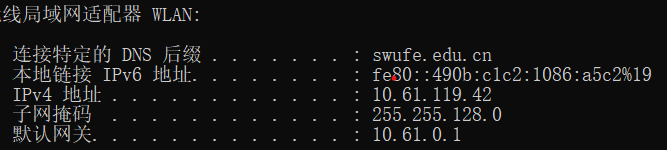
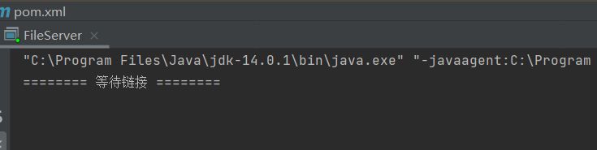
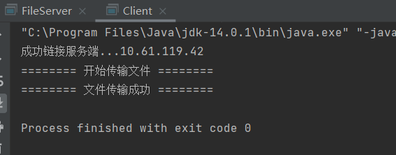
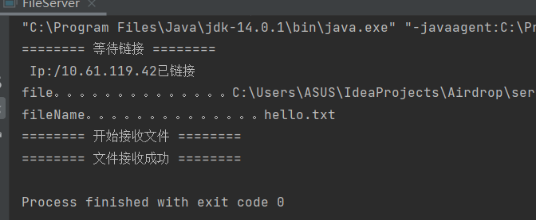

对于这次的仿airdrop作业，我实现了基本的传输文件功能，定义服务端与客户端，模拟电脑和手机，对于客户端的IP与port，将其直接体现在程序中，然后文件的传输即可在链接成功后得到实现。

由于我的web界面的设计实施遇到Tomcat无法启动的报错问题加之没能够解决，所以关于相关界面设计没能在程序中体现。

下面介绍具体操作流程：
## 获取IP
在本机上命令行窗口输入ipconfig查询客户端IP,默认端口号8080

可以得到IP：10.61.119.42，并将其赋给需要传输文件的客户端

启动之前可以看到文件位于client目录下，也即手机需要传输的文件

## 服务端

启动服务端new ServerAirdrop(port)

接收链接服务端的客户端对象

建立返回套接字的输入流

建立文件输出流写出文件

读取文章名称，长度等属性

读取、写入文章操做

关闭流

## 客户端
经过new Airdrop("ip",port)链接服务端

建立文件输入流读取文件

建立返回套接字的输出流

写入文章名称，长度等属性

读取、写入文章操做

关闭流线程

客户端成功链接上服务端后，client可以实现通过IP以及Port传输文件至服务端

